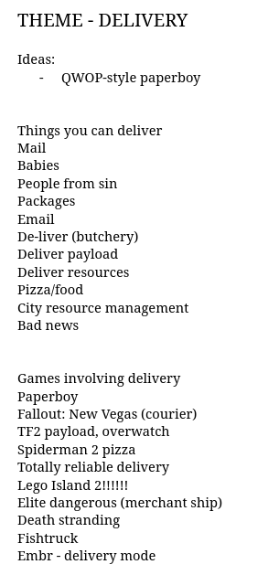

I've participated in a lot of hackathons (at least one each year that I was in college), but I can't say I've done all that well until recently. Last spring, a few friends and I took part in Ludum Dare 53 where we placed in the top 100 overall and top 20 in humor (you can check out our game [here](https://ldjam.com/events/ludum-dare/53/spam-simulator)). While this certainly isn't as much success as others have had in this style of competition, this is where I think these competitions finally "clicked" for me.

The major lesson to be I learned from this experience, and something that I believe played a huge role in our success is *know what you're actually making*.

While this seems like something obvious, it's important to note that in software development, it's very easy to lose sight the project you're working on. This is especially true if you have the threat of some form of deadline.

The best way to know what you're actually making is to take the time to plan and brainstorm ideas prior to starting development. While it may be tempting to start work and throw things at the wall until they stick, the minutes you spend in planning will save you hours of development time.

I'd figure I'd document the brainstorming process we used for future game jams both for my future reference and to maybe guide others. While this guide is written in terms of a game jam, there isn't any reason why this also couldn't be applied to more general hackathons.

During the competition, we set ourselves a hard time limit of one hour to brainstorm and managed to follow a process that roughly corresponds to the one I outlined below. In reality, I think a good time limit for this is roughly 30 minutes, but definitely no longer than an hour. 

## 1. Know your theme

The first step is to get to know your jam's theme. Usually in game jams, a theme is announced just as the competition starts. This theme can be a word or phrase that dictates the gameplay or thematic elements that entries should incorporate. For Ludum Dare 53, the theme was *Delivery*.

Start by identifying concepts that relate to the theme - either directly or indirectly. These can be:

- Alternate definitions of words in the theme
- Idioms, puns, metaphors, etc.

You can also look at other games that fit your theme and adapt from there.

However, two things you should keep in mind are:

- Avoid low-hanging fruit
- Be aware of your competition's demographic

These two things ultimately influence both the kinds of games that will be submitted and how games will be judged. For example, we opted not pursue a game related to "de-liver" (i.e. butchery) or (carrier) pigeons as we assumed that those ideas over used because they are **frickin unique and weird** and low-hanging, respectively.

*We were correct in this assumption.*

## 2. Flesh out ideas - elevator pitches

Next, pick your favorites from this list and write them down - each person involved should do this separately - with a maximum of two sentences per idea or concept. Think of these are your elevator pitch for these hypothetical games.

.")

As we move through these few beginning steps, the general trend should be to gradually reduce ideas to only the best ones. Don't feel the need to come up with an idea for every concept - in the end you want a single, crystalized idea to build off of.

## 3. Identify the complexity and feasibility of ideas

In this step, you going to take those pitches that you (and your teammates) came up with and sort them based on feasibility and complexity.

**You're going to have to be honest.**

You need to understand your (and your teammates) strengths and weaknesses and the speed at which you work. In our case, going into the competition we had a solid idea of what everyone's individual responsibilities were going to be, plus we each had professional experience in our given fields (software development, and art/design), so we each had an idea of what we could handle.

We organized our ideas on two axes: the horizontal axis is the dimensional complexity of the game (2D or 3D), and the vertical axis is the mechanical complexity (game logic, game controls, etc.). In essence, as you go from bottom left to top right in the chart, the overall complexity of the game increases. 

## 4. Figure out what the team likes

Having something everyone can latch onto gives everyone a stake in the project and makes working on the project more enjoyable everyone. That's why in this step your team as a group should figure out what you like.

Remember that we want to weed-out ideas. If no one absolutely loves a particular idea, don't be afraid to toss it out. At this point, you should have narrowed it down to a single idea. If not, go back to step 3 and reevaluate from there. 

## 5. Clarify details

Now that you have your crystalized game idea, it's time to think of some details. Start high level and then get more granular. Try to formulate the main mechanics and game play loop as soon as possible. From there you can ask yourself questions about different aspects of the mechanics and how they would interact with each other.

One question you should definitely try to answer is *what is the player's incentive(s) to keep playing? *. Answers can include things like "get a high score" or "finish the story". Tie the answer to this question back into your mechanics. If you can't answer this question, maybe reevaluate the idea - you want to give people a reason to play your game.

You can also start thinking about art assets. What style or aesthetic should your game have? A good idea is to make a mood board for inspiration: take screenshots from other media that you'd like to incorporate, or read up some art movements or well-known visual art styles.

## 6. Keep track of what needs done.

The last, and arguably most important, step is keep track of what needs done.

Don't just memorize what needs done - *write it down*. You can't really rely on your brain in this scenario as stress, the deadline, and possibly lack of sleep will cause you to forget things.

There's plenty of protocols for doing this all of which are good: Kanban, a whiteboard, sticky-notes, notebooks, etc. We used our Figma board as we already had all of our other documentation on it anyway.

Though I think any protocol works and don't recommend any of them in particular (just pick the one you like), I do recommend you divide your categories into five categories:

1. **Minimal Viable Product (MVP)** - these are tasks that are absolutely necessary for the game and need finished prior to submission. These should be prioritized over everything else.
2. **Bugs** - keep track of these as they arise; take care to focus on the ones that interfere with the MVP, but don't really worry about the other ones. Once the MVP is completed you can take another look and fix up the rest.
3. **Polish** - these are things that aren't necessary but would be to have or change. Maybe the controls aren't as tuned as you want or some events to fire at the correct time, etc. You will have to prioritize what should be polished and what bugs need fixing - these will be on a case-to-case basis. Be wary that polishing may introduce new bugs.
4. **Submission Tasks** - these are the extracurricular tasks that don't have to do with development but are necessary for the competition: a game page, Git repo, README, showcase art, presentation, etc.
5. **Stretch goals** - These are elements that either extend concepts already present in the MVP or are newly introduced. You won't necessarily get to work on these, but it's good to keep track of them in case you want to continue to work on the game after the competition is over.

If done right, you should have a decent basis to begin work. At this point, if you feel a bit light on todos, don't worry. A large part of development is "discovering" the game - just now you won't be building on a foundation of sand.
