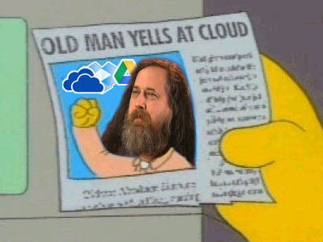

This was something I've been thinking of doing for a while. What really kicked me into high-gear was learning about [Hugo](https://gohugo.io/) - or really learning [how to use Hugo](https://www.youtube.com/watch?v=ZFL09qhKi5I). I just wanted to use something that I could have more direct I control over instead of some CMS like WordPress.

## Social media wastes my time

My motivation for starting this site is part of my ongoing crusade to self-host pretty much everything. About 2 years ago, after replacing my gaming computer, I decided to reuse it and set up a Linux server. At the time I just used it to [sync notes](https://syncthing.net/) between my devices for school. Since then, I've pretty much moved all of my cloud services to my home server.

The one aspect of my technological life that I haven't really touched is my social media usage. I did delete Twitter and Instagram off my phone a while ago, and my Reddit usage has plummeted ever since their API changes. Additionally, since the start of the year, my overall phone usage has dropped by about 20 percent, but I'd still like to reduce it further. 

I've actually been working on [a project](/projects/filterfeed) that will hopefully replace my use of traditional social media altogether, but in the meantime I hope contributing to this website might help cut down on my time.

## Using that time to exercise my brain

Creating this website is also an extension of my soft New Year's resolution of reading more books. Reading for entertainment or to learn subject matter outside of my job field is something I don't really do. Reducing my social media usage would give me time to pursue that. So far, I've read a handful of books - I slowed down at the end of spring, but I've picked my pace back up again.

")

Another positive aspect of this website is to exercise the expository and persuasive writing parts of my brain - things I haven't really used since school (I mostly consume and write technical documentation now). So, hopefully, it will help get my creative juices flowing.

## Showcasing my projects

Another purpose I want this site to serve is a showcase for my various [projects](/projects). There's as few projects I've been wanting to revisit, and creating write ups for them seems like a good way to do that.

## About this site

This site was made with Hugo. The look of this site is based on [Eric Murphy's site](https://github.com/ericmurphyxyz/ericmurphy.xyz), but I built the theme up using his [starter theme](https://github.com/ericmurphyxyz/hugo-starter-theme) as a basis.

The source code for this site can be found [here](https://github.com/SPIGS/parkerspielvogeldotcom).

Lastly, an [RSS feed for this site](/index.xml) can be found in the footer along with a link to my GitHub. The RSS feed will only contain blog posts as my project write ups will be fairly infrequent (I might just post them all at once).
