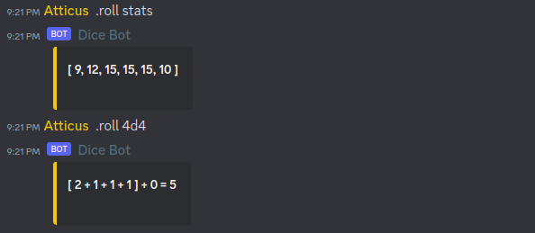

## About

DiceBot is a Discord bot that I made sometime in 2018 for my friends and I so it would be easier for us to play *Dungeons & Dragons* virtually (this was before we knew about [Foundry](https://foundryvtt.com/)). We had used *Roll20* prior but we felt that its user experience was very clunky and that too many convenience features were hidden behind their paywall. In addition, I had organized a West Marches-style campaign (a larger scale, drop-in/drop-out sandbox style campaign), and it was easier just to have everyone join a Discord server rather than having them go through the process of making an account for another website.

## Features

### Dice Rolling Grammar

The one feature that I'm probably most proud of is the bot's context-free dice grammar. I wanted to make something more usuable than Roll20's dice grammar - particularly the ability to "roll" dice that can't be respresented by the standard platonic solids (for example a d2 for coin flips), and more robust mathematical operations (PEMDAS). In addition, it also has premade commands for things like character creation stat rolls. 

Hillariously, I made this prior to actually knowing was a context-free grammar was - I didn't actually learn about it until a few years later in school!

### Rules Reference

Something else that was useful was having a full reference to spells and equipment used in the game rules. In Roll20, we had to manually enter in everything our characters had if we wanted the rules for a spell or piece of equipment to be easily accessible. If we needed to reference something new, we would to manually search for it on D&D rules sites or look it up in the Player's Handbook. For DiceBot, I created a json database for spells and equipment and added a command to allow users to quickly search for and display spells.

## Acknowledgements and Further Reading

- [Context-free Grammars](https://web.stanford.edu/class/archive/cs/cs103/cs103.1142/lectures/17/Small17.pdf): Stanford lecture on context free grammars.