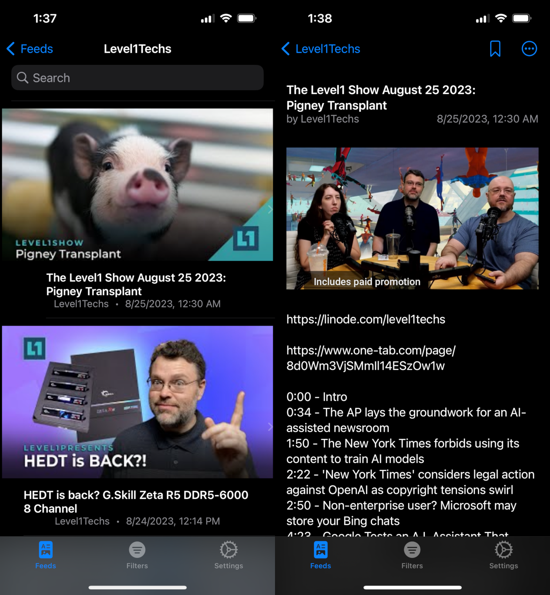
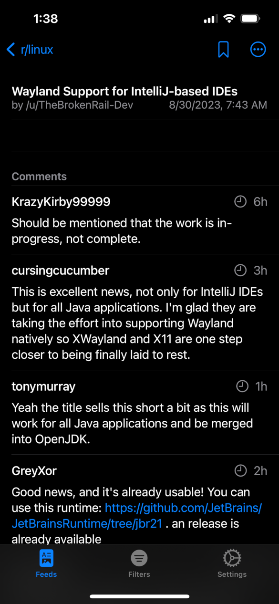
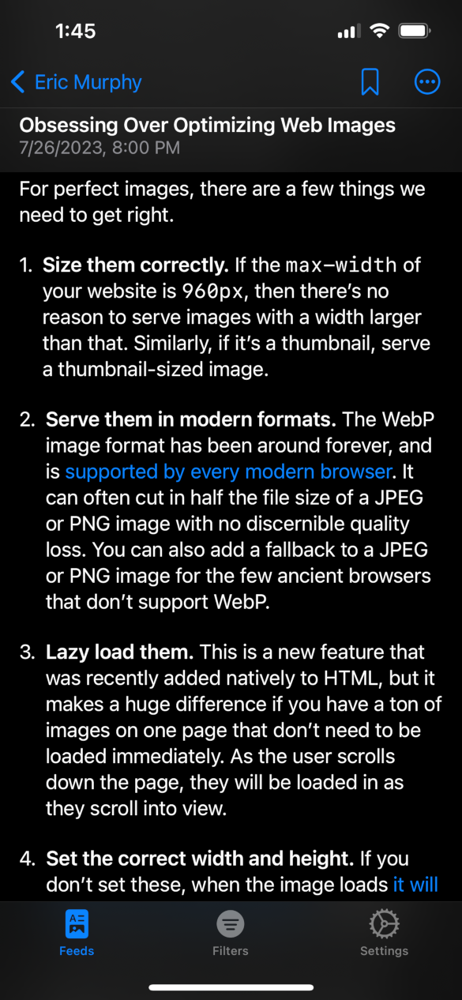

## About

FilterFeed is a [RSS](https://en.wikipedia.org/wiki/RSS) reader that aims to give the user maximum control over what content they view while attempting to retain the UI/UX of the content for ease of consumption.

FilterFeed started from a personal desire to limit my usage of social media. In short, I believe that social media is hazardous to one's mental health, but despite this, I can still recognize the utility of being able to access and search information in an immediate and user-friendly way. As such, I sought to limit my social media usage not by abstaining from it, but by augmenting how I retrieve and consume it:

 - Increase privacy by separating my consupmtion of content from the centralization of social media websites.
 - Give myself maximum control over what content is displayed on my screen.
 - Create a user interface that, while easy to use, removes the desire for involuntarily view content ([doomscrolling](https://en.wikipedia.org/wiki/Doomscrolling), [dark patterns](https://en.wikipedia.org/wiki/Dark_pattern), etc).

These desires have coalesced into this app. While FilterFeed isn't close to being complete, I believe that it is at a far enough point in its development that I am happy to talk about it. I'd estimate that it is just under 50% "done," with the *feed* part of *filter feed* being nearly completed.

## Features

### No APIs

FilterFeed does not use any propriatary APIs to fetch post and feed information. It only uses the RSS and Atom feeds published by sites and then parses and displays the data from there - just like any other RSS reader. I'm predicting other tech companies will be following the lead of Reddit and Twitter by hiking prices on their available APIs, and as such I do not want this app to rely on them.

While this is great in terms of cost and privacy, one may argue that it's not good in terms of interactivity: the lack of APIs users won't be able to interact with content. However, while this is true, I don't think that it is important. As the vast majority of internet userbases comply by the [1% rule](https://en.wikipedia.org/wiki/1%25_rule): *only one percent of users of a site actually contribute to that site*. So, in actually I don't think users will miss the ability to interact with content - who wants to argue in Youtube comments, or "dunk" on people on Twitter/X anyway?

All other useful functionality such as saving posts and searching feeds are handled by the app itself.

### No server

All processing for the app is done on-device, this includes fetching posts and displaying them. In addition, all user generated data is stored on device (saved posts, user preferences, etc.).Lastly, the app only makes requests when the user does something: tapping on a post to view it or manually refreshing a feed. The only requests the app makes are GET/FETCH requests. I think that most people underestimate the power of hardware, particulary those of lower-end computers and smartphones. These of devices have a lot of unused computing power hidden by software that can't/won't take advantage of it.

### It looks pretty

I think one of the main problems with most RSS readers is that they are clunky to use and look bad. While this isn't necesarily the fault of those who make them, as I feel those who work on RSS readers mainly want them for their utility, I think the lack of good usability puts off the average person from adopting them. I'm aiming to make the UI/UX of the app more inline with modern UI/UX sensibilities. I've created several different view for different "content types" which allow the content of the feeds to be displayed in way conducive to viewing it. Below you can see some examples:

Additionally, I wrote a converter which turns the HTML of the feed content into a format that can be displayed as rich text on iOS. I did this so there is a consistant feel across the app and to remove formatting from the content. I want the app to look and feel as if it were made by Apple.

## Plans

1. Finish the feed system (caching, make the parser more robust, etc.)
2. Add filters
3. Finalize look and feel
4. Release on Appstore (?); Release source code (?)

## Acknowledgements and Further Reading

- [AlertToast](https://github.com/elai950/AlertToast/): library used for Apple-like toast alerts
- [OpenGraph](https://github.com/satoshi-takano/OpenGraph): A Swift wrapper for the Open Graph protocol; used for some minor scraping of profile/account images.
- [SDWebImageSwiftUI](https://github.com/SDWebImage/SDWebImageSwiftUI): A web image loading framework
- [YoutubePlayerKit](https://github.com/SvenTiigi/YouTubePlayerKit): a library to display and play embedded Youtube videos
- [SwiftSoup](https://github.com/scinfu/SwiftSoup): an HTML parser; used in the rich text converter
- [FeedKit](https://github.com/nmdias/FeedKit): an RSS, Atom, and JSON feed parser; used as the base of the feed system
- [RSS in Plain English](https://www.youtube.com/watch?v=0klgLsSxGsU)
- [The Coddling of the American Mind](https://www.thecoddling.com/)
- [The Social Dilemma](https://www.netflix.com/title/81254224)

