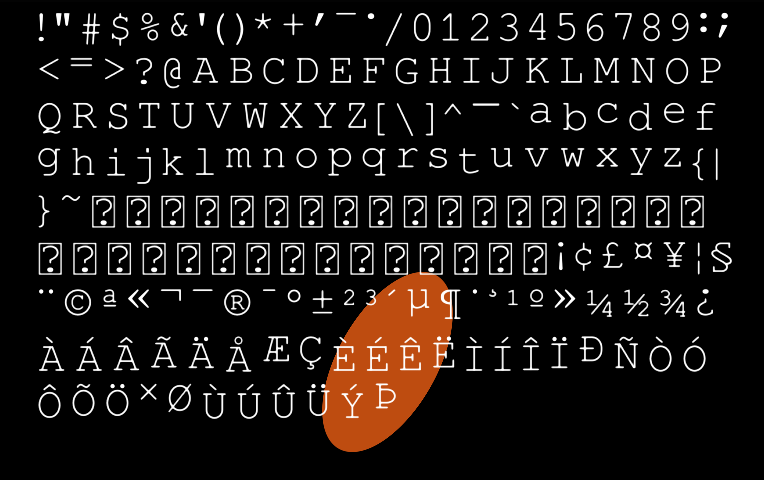

## About

I've always preferred working with small rendering libraries over traditional game engines. In fact, one of the first libraries I ever used was a little library called Slick2D. It was a small wrapper for [LWJGL](https://www.lwjgl.org/). I always liked the freedom that these libraries provide as they leave a lot of the program structure, set-dressing, and other utilities up to you. I've been in search for a new one for prototyping games or UIs. However, most of the ones I've found haven't been to my tastes.

I've tried [Sokol](https://github.com/floooh/sokol), [Raylib](https://www.raylib.com/), and [SDL](https://www.libsdl.org/). However, none of these really scratch my itch. My problem with them is I feel like they try to do too much: 2D, 3D, input, sound, context managment, etc. I just want something that can:

 - Create an application window
 - Capture user input
 - Put pixels on the screen

Since I couldn't find any libraries I liked, I just started working on my own. I decided to use OpenGL since it's probably the most well known/documented graphics API available. Plus, I've wanted to dabble in lower-level graphics programming since I took a computer graphics class in school. 

The goal is to develop a library that fulfills my three requirements. Also, I'd like it to be able to freely integrate with other libraries for things such as physics or audio. Another requirement is a small codebase and dependency list: I want to minimize the overhead that the library would bring and to make it as transparent as possible so I can have a better understanding of what is happening at a lower level and so others might be able to learn about OpenGL/graphics programming.

Currently this library only has 4 dependencies: `opengl`, `glew`, `glfw3`, and `freetype2`. I have a feeling that this won't increase since I'm able to accomplish most if not all of the things I want the library to do with just these dependencies. Having so few dependencies makes it easy to build with a simple Makefile. I believe that having a straight forward build process also aids in understanding a program and how everything fits together.

## Features

### Utility Functions, Data Structures, etc. 

All utility functions, data structures, and underlying set-dressing was made by me. This includes things like color datastructures and linear algebra functions.

### Everything is a Shader

Everything that is displayed to the screen is a quad with a shader - each geometric primitive and font glyph is comprized of a single quad and an accompanying shader. Shaders are loaded from disk on application start up. I did this because it makes for a simpler renderer (all draw calls are batched quad vertices) and I'd rather write a few shaders than worry about architecting a renderer.

### Fonts

Fonts utilize `freetype2` to load font files into memory and create signed distance fields to feed into a glyph shader. This allows for the glyphs to be scaled easily without major loss in quality.

## Plans

1. Add more geometric primitives
2. Finalize font rendering: display and format text, non-monospaced fonts
3. Dogfood a program or prototype with it
4. Optimization (?)

## Acknowledgements and Further Reading

 - [OpenGL Playlist](https://www.youtube.com/playlist?list=PLlrATfBNZ98foTJPJ_Ev03o2oq3-GGOS2): a playlist by [The Cherno](https://www.youtube.com/@TheCherno) on OpenGL. I used this to learn the basics. The playlist hasn't been updated in a while, but he has newer OpenGL content so just look on his channel.
 - [docs.gl](https://docs.gl/): OpenGL API Documentation
 - [Improved Alpha-Tested Magnification for Vector Textures and Special Effects](https://steamcdn-a.akamaihd.net/apps/valve/2007/SIGGRAPH2007_AlphaTestedMagnification.pdf): the Valve paper on signed distance fields for font and decal rendering