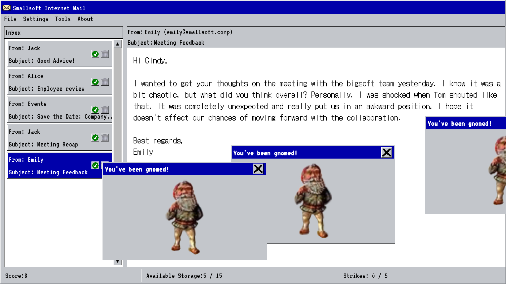

> Welcome to smallsoft! Your job is to filter out spam from our email delivery system before our server runs out of storage. Try not to get a virus, and live the monotonous lives of our employees vicariously through their inboxes.

## About

Spam Simulator was my friends and I's entry into the [Ludum Dare](https://ldjam.com/events/ludum-dare/53/stats) 53 game jam and our first time ever competing in a game jam. The Lundum Dare is prehaps the most well known game jam and consists two formats. The first of which is *The Compo*, a 48 hour solo game jam where all assets and code must be made from scratch inside of the 48 hour window. The second format is *The Jam*, a 72 hour solo or team-based game jam where basic assets (art, game frameworks, engines, etc.) may be used but the game itself must be made within the 72 hours. The Jam was the one we entered since we were entering as a team and it was our first time competing. Each Ludum Dare begins with several rounds of voting for a theme. Games made during competition must conform to the theme. Each theme is usually a word or phrase with this competition's theme being *Delivery*.

Games are submitted at the end of the competition and rated by members of the community. Games are judged on several categories: fun, innovation, theme, graphics, audio, humor, and mood. Lastly, there is additional "overall" rating. Ratings are in the form of a star system from 0.0 to 5.0 stars.

## The Game

In Spam Simulator you take the role of an unnamed IT employee of the burgeoning 90's software company *smallsoft*. You're job is to filter out unwanted emails from the company's email system. All the while keeping server usage low, listening to directions from your Administrator, and trying not to infect the company's network with viruses.

The game's interface is that of a 90's email client, and we tried to give everything a Windows 95/98 aesthetic. All dropdowns, buttons, scrollbars, and popup windows work just as you expect from a Windows-like program or operating system.

The game is a survival game. As you play, the rate at which emails come in increases. In addition, emails containing viruses begin to appear - which may cause distractions or impose penalities. The game ends when your "Available Storage" on the server is filled or when recieve too many "Strikes" from your Administrator; strikes are caused by filtering out good emails or passing bad emails.

Within the 72 hours, we managed to complete all of the main features of the game in addition to making art assets (art, sound, music, and emails writings). Not only that, we ended the jam with it nearly bug-free (I believe there are only 1 or 2 non-game-breaking bugs in the final release). We used the Unity Engine to make the game and thus were able to release it for all major operating systems (Windows, Mac, and Linux). Below are our scoring results:

> **Results** *(there were a total of 2310 submissions with 1720 of them being the Jam)*
> 
> Overall: **92**nd (!)
> 
> Fun: **211**th
> 
> Innovation: **61**st
>
> Theme: **111**th
>
> Graphics: **262**nd
>
> Audio: **131**st
>
> Humor: **16**th (!)
>
> Mood: **69**th

## Postmortem

*I haven't written an adequate postmortem yet.*

## Plans

We are comtemplating finishing the game and releasing it on [itch.io](https://itch.io/).

## Acknowledgements and Further Reading

- Brian: programming and design
- Mitchell: art and design
- [The game's competition page](https://ldjam.com/events/ludum-dare/53/spam-simulator)